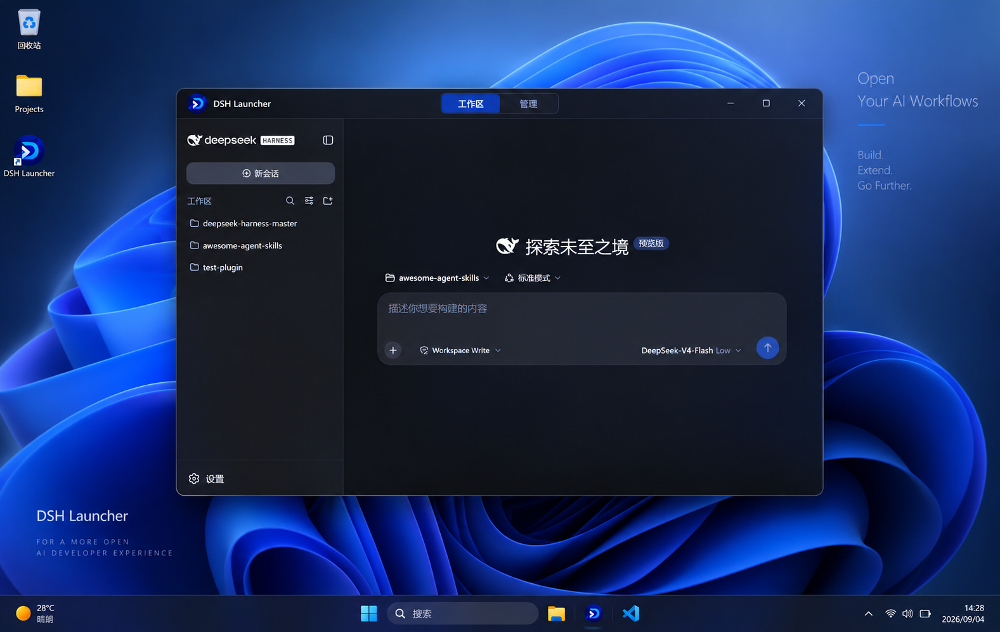
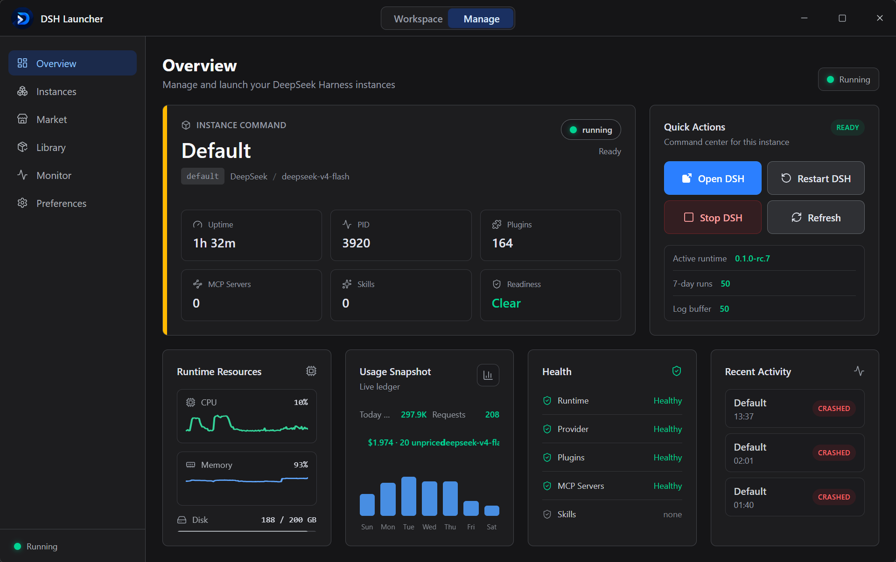
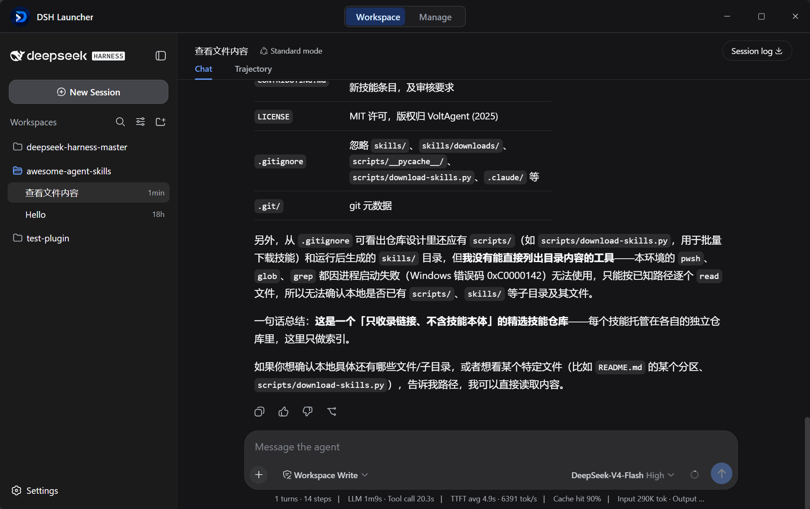
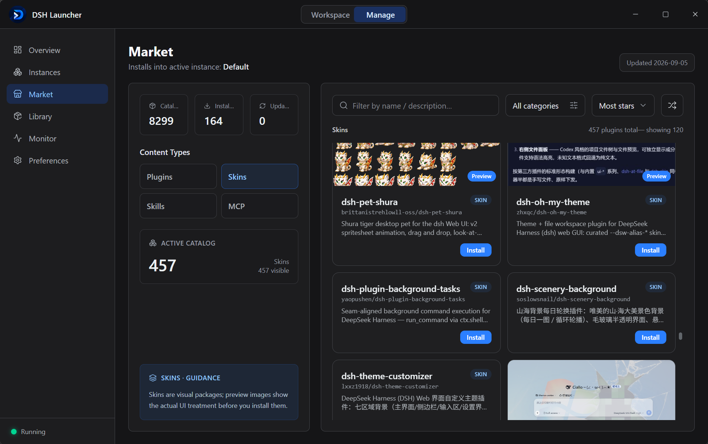
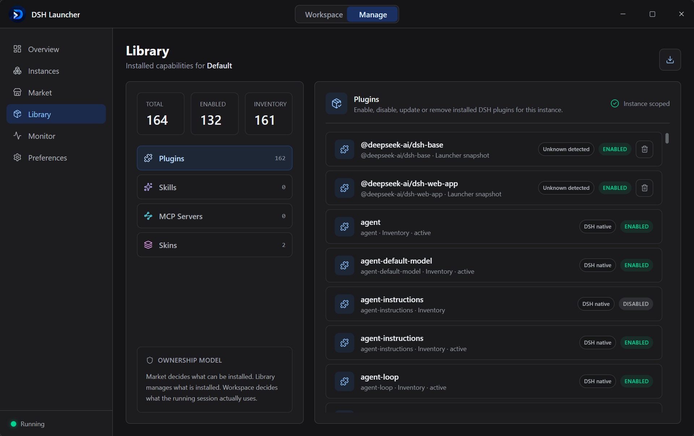
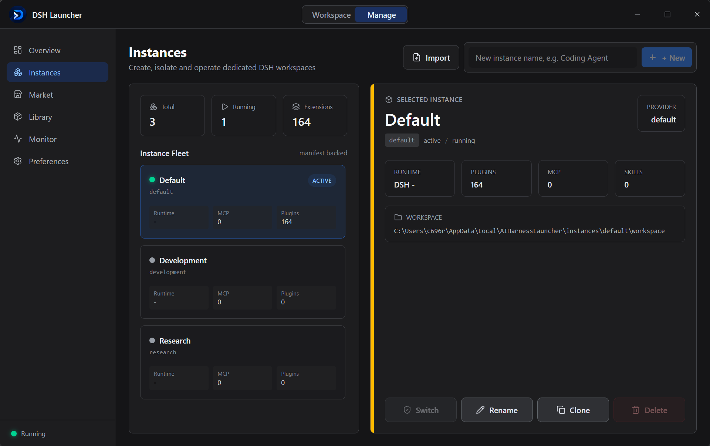

<p align="center">
  
</p>

<h1 align="center">DeepSeek Harness Launcher</h1>

<p align="center">
  <strong>DeepSeek Harness 的本地运行与生态管理平台 —— 统一管理运行时、实例、模型供应商、Plugins、Skills、MCP 与启动环境。</strong>
</p>

<p align="center">
  无需手动配置运行环境，开箱即用。Desktop Shell 只是其中一种交互方式；运行时、实例与生态内容由 DSHL 统一管理。
</p>

<p align="center">
  <a href="https://github.com/rootkiller6788/dsh-launcher/releases/latest"></a>
  <a href="https://github.com/rootkiller6788/dsh-launcher/releases"></a>
  <a href="https://github.com/rootkiller6788/dsh-launcher"></a>
  <a href="LICENSE"></a>
  
  
  
  
</p>

DeepSeek Harness Launcher 把 [DeepSeek Harness](https://github.com/deepseek-ai/deepseek-harness) 的本地 Web UI、Host 服务与插件系统集成进原生桌面应用。它负责窗口、托盘、运行时、工作配置与更新，并透过 DeepSeek Harness 提供的插件机制与上游能力组合。固定并原样运行特定上游版本，不 fork、不改上游行为。

<p align="center">
  
</p>
<p align="center">
  
</p>
<p align="center">
  
</p>
<p align="center">
  
</p>
<p align="center">
  
</p>

## 下载与安装

当前安装包支持 Windows x64（Ubuntu 即将支持）。无需额外环境，下载安装，一键使用。

| 平台 | 下载 | 安装方式 |
| --- | --- | --- |
| Windows x64 | [下载安装程序](https://github.com/rootkiller6788/dsh-launcher/releases/latest) | 运行 NSIS 安装程序并按提示完成安装 |

### 从源码构建

依赖：Node ≥ 22、pnpm ≥ 10、Rust（MSVC 工具链）、WebView2（Win 11 已内置）。

```bash
pnpm install                 # 前端依赖
cargo build --workspace      # 编译全部 Rust crate
pnpm build                   # tauri build → NSIS setup.exe
# 产物：apps/desktop/src-tauri/target/release/bundle/nsis/*-setup.exe
```

## 功能特性

- **开箱即用的运行时** — 安装包内置 Node 22；DSH 通过四层链解析（settings 覆盖 → 内置 → 受管 `runtimes/<ver>/` → PATH）。无需 Node、无需 pnpm、无需源码检出。
- **受管运行时** — 安装 / 切换 / 删除 / 校验多个 DSH 版本并存；每个实例锁定自己的版本。
- **多实例隔离** — 每个实例独立的 `$DSH_HOME`；插件与配置在实例之间绝不串流。创建 / 重命名 / 克隆 / 删除 / 切换。
- **模型供应商** — API key 存 Windows Credential Manager，绝不落盘明文；预置供应商库 + 模型目录同步。
- **插件市场** — 皮肤 / 技能 / MCP / 捆绑包五种目录；注册表浏览 + 智能（LLM 重排）搜索 + 安装 / 卸载 / 热启用停用（经 `cordis.patch.yml` 层，可跨 `dsh plugin` 对账存活）。
- **MCP 生态** — 安装时 probe 检测、配置缺口显性化（degraded 自述 + 0 工具两种信号）、配置弹窗填写、值存 OS 凭据库并在启动时注入运行环境。
- **DSH 内嵌窗口** — DSH 渲染在启动器自有窗口内（而非浏览器标签页）；关闭窗口即停止 harness。
- **双向主题同步** — 浅色 / 深色 / 跟随系统，一个开关：启动器或 DSH 任一边切换，两边同步。
- **进程树加固** — Windows Job Object（`KILL_ON_JOB_CLOSE`）+ 递归 `taskkill /T /F` 兜底 + 启动前僵尸清扫。连续 10 次启停零残留。
- **启动历史** — SQLite 记录的会话，含开始 / 结束时间戳与崩溃 / 退出状态。

## 快速上手

1. **安装** 并启动 AI Harness Launcher。
2. **偏好 → 供应商** — 粘贴 DeepSeek API key（存 Windows Credential Manager）。
3. **首页** — 选实例，点 **启动**。

DSH 在自有窗口内启动；Activity 面板实时流式输出 stdout/stderr。同一按钮或关闭窗口即可停止。

## 仓库结构

```
dsh-launcher/
├── apps/desktop/               Tauri 2 应用
│   ├── src/                    React 19 + TS 前端（Vite、Tailwind v4、Zustand）
│   └── src-tauri/              Rust 外壳：commands/、state/、tauri.conf.json、vendor/node
├── crates/
│   ├── launcher-core/          框架无关核心：paths/settings/instance/provider/process/runtime/market/mcp
│   └── dsh-adapter/            DSH 专用适配器（RuntimeAdapter 实现）：runtimes/theme/mcp probe/import/resolver
├── tui/                        dsh-tauri 参考镜像（内嵌窗口机制）
└── scripts/                    开发辅助（图标生成、目录生成、解析器）
```

**语言边界（有意为之）：** TypeScript 负责 UI；Rust 负责系统（进程、文件系统、网络、密钥、SQLite）。所有系统动作经类型化 Tauri IPC —— 见 [`CONTRIBUTING.md`](CONTRIBUTING.md)。

## 数据目录

默认所有数据位于 `%LOCALAPPDATA%/AIHarnessLauncher/`。**便携（绿色）模式**下根目录即 exe 所在目录 —— 把 exe（连同内置资源）丢到任意位置，每个字节都留在它旁边，整个启动器可随 U 盘移动。

```
<root>/
├── settings.json            应用设置（DSH 路径覆盖、主题、最近实例）
├── providers.json           供应商元数据（API key 在 Credential Manager，绝不在此）
├── launcher.db              SQLite 启动历史
├── runtimes/                受管 DSH 版本 + 内置 node
├── instances/<id>/          instance.json + workspace/（= 该实例的 $DSH_HOME）
├── cache/                   注册表 + 下载缓存
└── logs/launcher.log        应用日志（panic 时另有 crash-*.txt）
```

## 环境变量

| 变量 | 用途 |
| --- | --- |
| `AHL_HOME` | 覆盖数据根目录（默认 `%LOCALAPPDATA%/AIHarnessLauncher`；开发 / 测试） |
| `AHL_PORTABLE` | 置为真值（`1`、`yes`、`on`…）强制便携模式：数据根 = exe 自身目录 |
| `DSH_CLI_BIN` | 覆盖 DSH CLI 入口（`…/apps/cli/lib/bin.js`） |

## 便携（绿色）模式

在启动器 exe 旁建一个空 `portable`（或 `.portable`）文件，下次启动即切换为便携模式：`runtimes/`、`instances/`、`settings.json`、`cache/`、`logs/`、`launcher.db` 全部落在 exe 旁。删除标记即回到按用户安装布局。模式在偏好 → 数据存储中可见。API key 始终留在 Windows Credential Manager，不随文件夹迁移。

## 参与贡献

欢迎提交 PR —— 先读 [`CONTRIBUTING.md`](CONTRIBUTING.md)（分支 / 提交规范、PR 流程、代码与测试标准）。

## 许可

[MIT](LICENSE) © 2026 dsh-launcher contributors。
